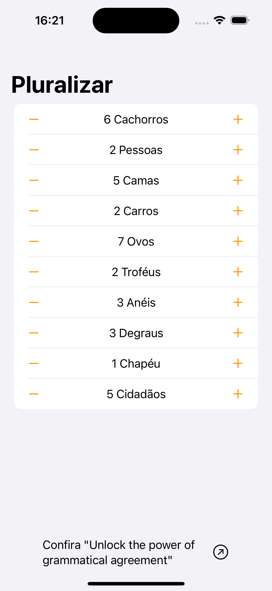

# Pluralize

Make use of Swift Inflect operator to pluralize strings!

In this example, we make use of the operator to pluralize strings in English and Brazilian Portuguese (using Localization strings).

## English words

 

## Brazilian Portuguese words

 

### Considerations

If you would like to see the language changes on your Xcode preview, go to:

Then select "Run" on the left panel, "Options" on the top options and on "App Language" select the desired language. Preview will automatically update with the selected language.

Hope you enjoyed, bye!